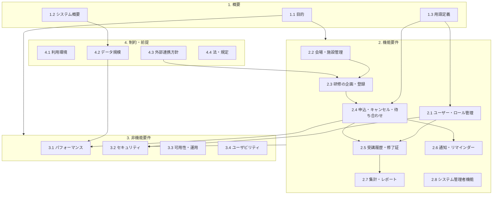

# システム要求仕様書（4章用）分析レポート

## 1. ドキュメントの全体構成（章立て）
本ドキュメントは、標準的な要求仕様書の構成に従いつつ、研修管理特有の複雑な業務フローをカバーしており、以下の4章で構成されています。

1.  **1. 概要**: システムの目的、全社規模（2,000名）の利用想定、および「待ち合わせ」「研修管理者」といった独自用語の定義。
2.  **2. 機能要件**: ユーザー管理、会場管理、研修企画、申込・キャンセル、履歴管理、通知、レポート、管理者機能といった多岐にわたる機能。
3.  **3. 非機能要件**: 高負荷耐性（50件/秒）、SSO連携、複雑な認可制御、多言語対応への設計など。
4.  **4. 制約・前提**: モバイル利用の想定、データ規模、将来的な外部システム連携の可能性。

## 2. 各章の目的と内容
*   **第1章（概要）**: 
    *   **目的**: 全社展開する研修管理業務の範囲を明確にし、関係者間での共通認識を作る。
    *   **内容**: 「申込・キャンセル」だけでなく「履歴・成績管理」までを含む広範なシステム領域が定義されています。
*   **第2章（機能要件）**: 
    *   **目的**: 複雑な研修ステータス（企画→下書き→公開→申込→繰り上げ→修了）を規定し、開発の振る舞いを確定させる。
    *   **内容**: 特に「自動繰り上げロジック」や「PDF修了証発行」など、利便性とデータの正確性に関する要件が詳細です。
*   **第3章（非機能要件）**: 
    *   **目的**: 大規模利用に耐えうる頑健性と、機密性の高い受講履歴を守るための品質基準を定める。
    *   **内容**: 申込ピーク時のトランザクション制御や、部門単位の認可制御が品質保証の重要項目です。
*   **第4章（制約・前提）**: 
    *   **目的**: 開発スコープの境界線を引き、初期リリースの動作環境やデータ量を想定する。
    *   **内容**: 人事連携を「将来」と定義しつつ、モバイル端末からの利用を初期要件として明記しています。

## 3. 機能要件と非機能要件の区分
テスト設計においては、以下の通り検証対象を分類します。

| 区分 | 対象範囲（抜粋） | 検証の性質 |
| :--- | :--- | :--- |
| **機能要件** (2章) | 申込・キャンセル、自動繰り上げ、下書き編集、PDF修了証、CSV集計、報告ログ | 状態遷移テスト、境界値テスト、入出力検証。業務フローの正しさを確認する。 |
| **非機能要件** (3章) | 同時申込(50件/秒)、SSO認証、多ロール認可、モバイルレスポンシブ、多言語設計 | 負荷テスト、セキュリティ（認可マトリクス）テスト、マルチデバイス検証。 |

## 4. テスト設計に重要な情報が含まれている章
QAエンジニアとして重点的にテスト設計に盛り込むべき箇所は以下の通りです。

*   **第2.4節（申込・キャンセル・待ち合わせ）**: 
    *   **重要性**: 本システムのコアビジネスロジック。排他制御が必要な「定員・待ち合わせ」の状態遷移と、キャンセル発生時の「正確かつ迅速な自動繰り上げ」の網羅的検証が必須。
*   **第3.1節（同時申込パフォーマンス）**: 
    *   **重要性**: 「50件/秒の同時申込でも二重確定が発生しないこと」という具体的なKPP（重要パフォーマンス指標）が定義されており、性能・ストレス性能テストの核心となります。
*   **第3.2節（認可制御）**: 
    *   **重要性**: 4つのロールが複雑に絡み合い、かつ部門単位の管理範囲がある等、アクセス制御ミスが情報漏洩（受講成績等）に繋がるため、厳密な権限テスト設計が必要です。
*   **第4章（データ規模想定）**: 
    *   **重要性**: 「申込 約5,000件/年」などの想定データ規模が記載されており、ボリュームテストや年次集計のレスポンス検証のベースとなります。

---

## 5. ドキュメント構造図 (Mermaid)

