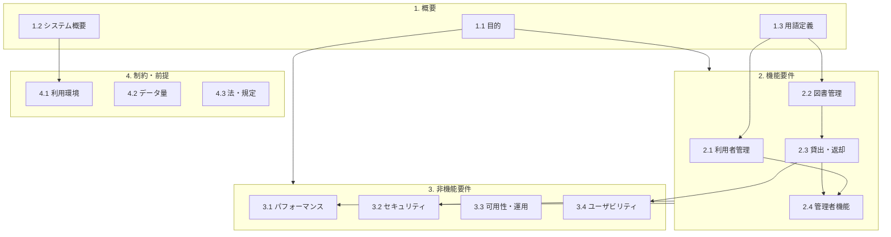

# システム要求仕様書 分析レポート

## 1. ドキュメントの全体構成（章立て）
本ドキュメントは、標準的な要求仕様書の構成に従っており、以下の4つの主要な章で構成されています。

1.  **1. 概要**: システムの背景、目的、およびドキュメント内で使用される用語の定義。
2.  **2. 機能要件**: システムが提供すべき具体的な機能（振る舞い）の定義。
3.  **3. 非機能要件**: 性能、セキュリティ、可用性など、システムの品質属性に関する定義。
4.  **4. 制約・前提**: 開発・運用における技術的制約や環境条件。

## 2. 各章の目的と内容
*   **第1章（概要）**: 
    *   **目的**: プロジェクトのゴールを共有し、関係者間での認識の齟齬をなくす。
    *   **内容**: 最大200名規模の社内利用を想定していることや、「図書」「貸出」といった基本用語の定義が含まれています。
*   **第2章（機能要件）**: 
    *   **目的**: システムが「何をするか」を明確にし、開発およびテストの対象を特定する。
    *   **内容**: 利用者管理、図書管理、貸出・返却の業務フロー、管理者用ログ機能など、主要な機能が網羅されています。
*   **第3章（非機能要件）**: 
    *   **目的**: ユーザー満足度やシステムの安定性を支える品質基準を定義する。
    *   **内容**: 応答時間（3秒以内）、同時利用数（20名）、認証・認可、バックアップ運用など、目に見えにくい要件が定義されています。
*   **第4章（制約・前提）**: 
    *   **目的**: 設計上の制限事項や、テスト環境構築の前提条件を明確にする。
    *   **内容**: ブラウザ環境（Chrome/Edge）、データ量（初年度500件）、遵守すべき社内規定が記載されています。

## 3. 機能要件と非機能要件の区分
テストエンジニアの観点から、それぞれの特徴を整理します。

| 区分 | 主な対象範囲（本仕様書より抜粋） | 検証の性質 |
| :--- | :--- | :--- |
| **機能要件** (2章) | 利用者管理、図書検索、貸出（最大5冊）、返却（14日間）、延長など | **ブラックボックステスト**が中心。業務ロジックや画面遷移が正しいかを確認する。 |
| **非機能要件** (3章) | 検索応答3秒以内、認証/認可、平日8:00-20:00稼働、3クリック以内の操作など | **性能・負荷テスト、セキュリティテスト、UI/UXテスト**など。特定のツールや計測が必要。 |

## 4. テスト設計に重要な情報が含まれている章
QAエンジニアとして、テスト設計時に特に注視すべきは以下の箇所です。

*   **第2.3節（貸出・返却）**: 
    *   **重要性**: ここには「1人最大5冊まで」「期限は14日間」「延長は1回のみ」といった**具体的なビジネスルール（条件）**が記載されています。境界値分析やデシジョンテーブルを作成するための最も重要なソースです。
*   **第3.2節（セキュリティ）**: 
    *   **重要性**: 管理者と一般利用者の「認可（アクセス制御）」のルールが明記されています。権限マトリクスを作成し、不正アクセスがないかを確認するテストに必須です。
*   **第4章（制約・前提）**: 
    *   **重要性**: **テスト環境の要件**（ブラウザ等）や、**データボリュームの想定**が記載されています。本番に近い環境・データ量での検証計画を立てるために不可欠です。
*   **第1.3節（用語定義）**: 
    *   **重要性**: データのエンティティ（図書、利用者など）の定義があり、データベースのテーブル設計やテストデータ作成の基礎となります。

---

## 5. ドキュメント構造図 (Mermaid)

